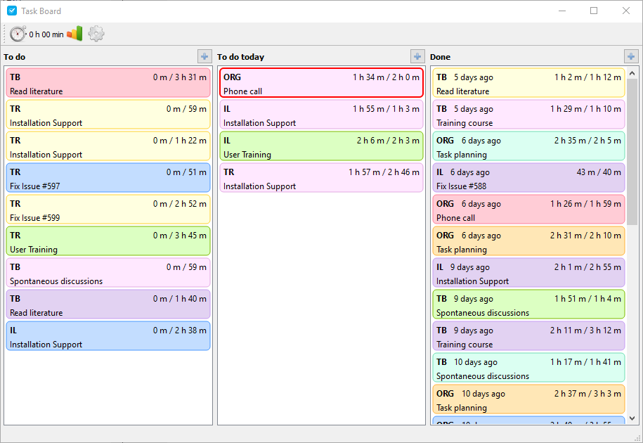

# Task Board

Task Board is a desktop application which lets you organize your work in projects and tasks, 
track your progress and assess the accuracy of your time estimates. You create several projects,
assign tasks to these projects and estimate how long the task will take. Task Board measures the
actual time you spend working on each task and generates several charts from the gathered information.
See e.g., how many hours you worked on a project during the last weeks or how the errors of your time estimates
are distributed.

## Features

* Organization of tasks in three columns with drag and drop functionality
* Creation of tasks as part of projects
* Time measurement for tasks
* Bar chart of your daily work effort
* Histogram and scatter plot of the estimate error distribution
* List the tasks you worked on during the last days, weeks or months

## Installation

Download and execute the latest installer for Windows from the GitHub release page.

## Documentation

In progress...

## Built With

* C++
* Qt 5.5.1 MinGW 32 bit

## License

This project is licensed under the GNU GENERAL PUBLIC LICENSE - see the [LICENSE.md](LICENSE.md) for details.